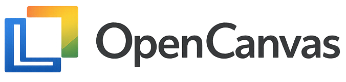
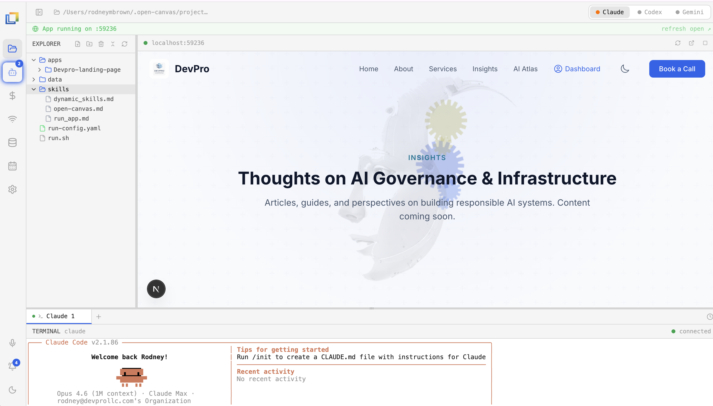
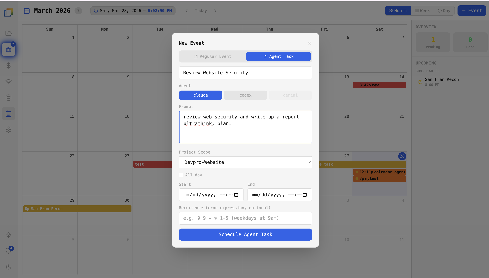
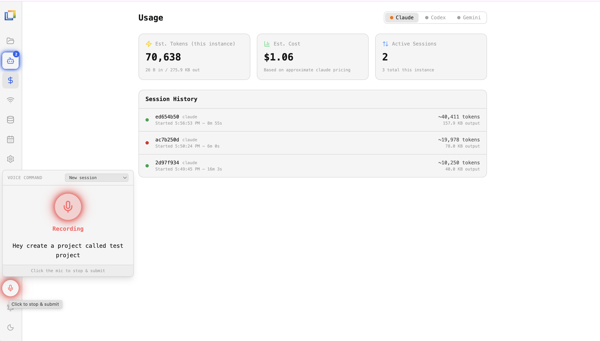
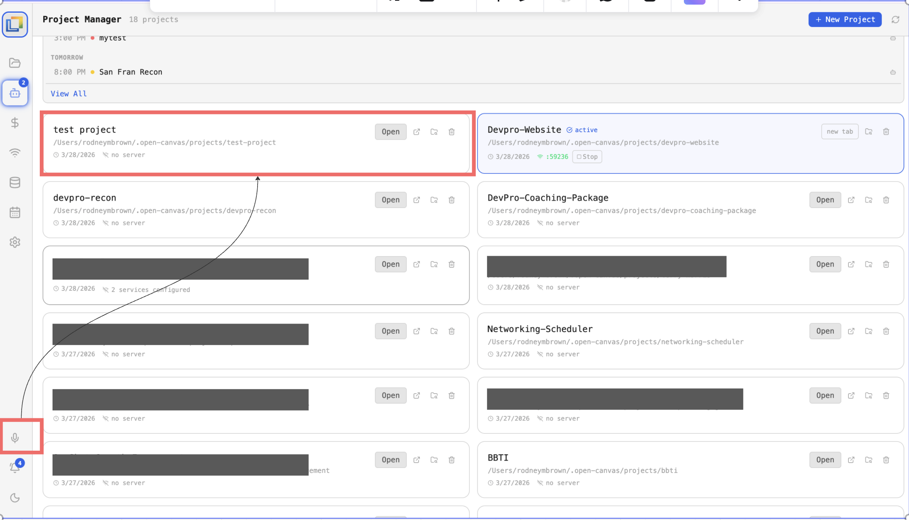
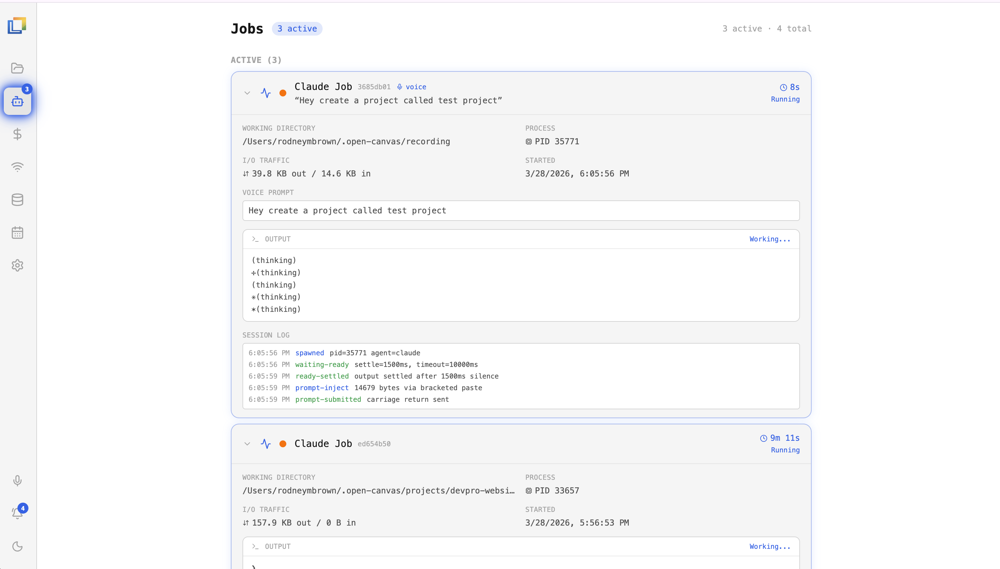
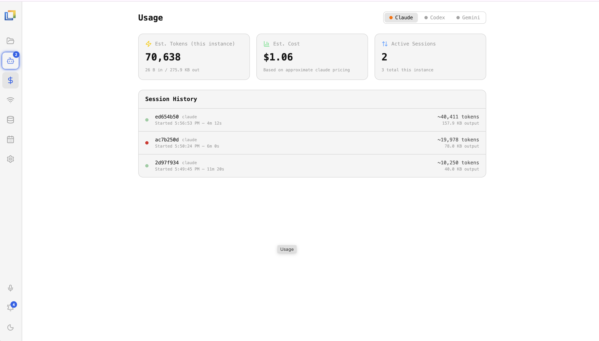
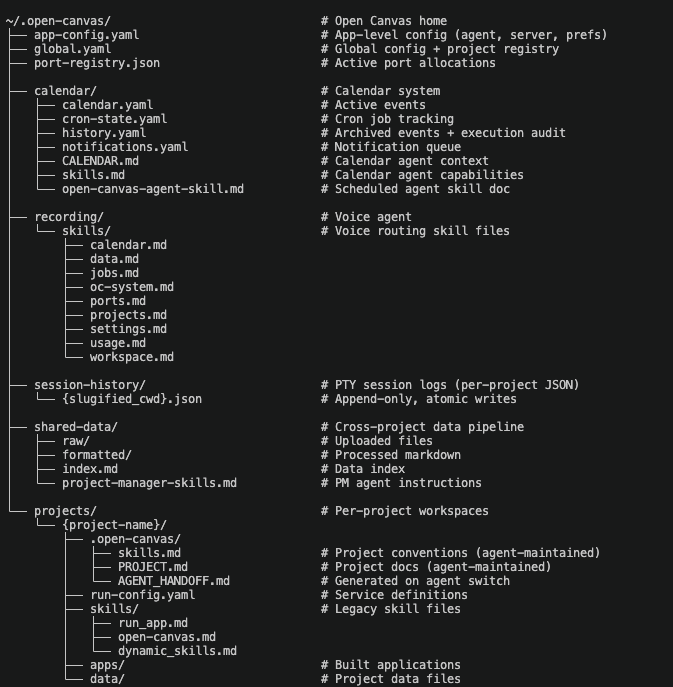

<p align="center">
  
</p>

<p align="center"><strong>Build apps from your data using the coding agents you already have.</strong></p>

<p align="center">
  <code>v1.2.0-beta</code> &nbsp;·&nbsp; Cost to run: <strong>$0</strong> &nbsp;·&nbsp; Runs locally &nbsp;·&nbsp; Uses your own Claude Code, Codex, or Gemini CLI
</p>

---

## Get Started

```bash
git clone https://github.com/rodneymbrown1/OpenCanvas.git && cd OpenCanvas
bash run.sh
```

Opens at [localhost:40000](http://localhost:40000). Select a folder, connect your agent, start building.

Requires Node.js 18+ and at least one coding agent CLI installed (`claude`, `codex`, or `gemini`).

---

## What It Does

Open Canvas is a local browser IDE that wraps your terminal coding agents in a project workspace with live app preview, file management, calendar-driven project management, voice control, and job tracking.

---

## Demo

### Project Workspace

The workspace is where you build. Each project gets a file explorer, integrated terminal, live app preview, and direct access to your coding agents. Switch between Claude, Codex, and Gemini in one click — same project, different agent. Drag files in from your desktop, run your dev server, and see changes live. Everything stays local.



### Calendar Agents

Calendar agents connect your schedule to your projects. Events on your calendar can be linked to Open Canvas projects, so agents have context about deadlines, milestones, and what's planned next. The Project Manager uses calendar data to help prioritize work and surface upcoming tasks. Think of it as giving your coding agents a sense of time — they know what you're working on today, what's due this week, and what's coming up.



### Voice Recording

The voice agent lets you talk to Open Canvas instead of typing. It has access to everything that's editable — your projects, workspaces, calendar, and settings. Start a recording session and give instructions by voice: create a new project, edit files, update calendar events, or direct your coding agent. The voice pipeline transcribes your speech, interprets the intent, and dispatches the action.




### Jobs

The Jobs view shows every active agent session. When you start a voice recording, it appears here as a running job — you can see the agent pick it up, the transcribed text that was extracted, and the prompt that was sent to Claude. All background work surfaces here so nothing runs invisibly.



### Agent Usage

Track token consumption and cost estimates per agent, per project. See what each session costs and how usage breaks down over time.



---

## System Overview: Persistence Architecture

Open Canvas uses a layered, file-based persistence model instead of a traditional database. All agent knowledge is stored in human-readable formats (Markdown, YAML, JSON) that LLMs can natively consume and produce — no vector store, no embeddings, no knowledge graph.


**Four layers, zero database dependencies:**

| Layer | Storage | Lifetime | Purpose |
|-------|---------|----------|---------|
| **Transient** | In-memory Maps | Process | Active sessions (max 50), port registry |
| **Semi-Persistent** | localStorage | Browser tab | Session state, terminal layout per project |
| **Persistent** | YAML / JSON / MD files | Permanent | Config, session history, skills, shared data |
| **Contextual** | Generated Markdown | On-demand | Agent handoff, context file discovery, skills templates |

**Write safety:** All file writes use atomic primitives (`tmp.{pid}` → `rename`) via `server/lib/safe-write.mjs`. Read-modify-write cycles are serialized per file path with an in-process async mutex. Persistence errors are logged to `~/.open-canvas/persistence-errors.log`.

**Why this performs well:**
- **Zero query overhead** — no database connections, no connection pools
- **O(1) file access** — every piece of knowledge has a deterministic path derived from the project
- **LLM-native formats** — Markdown and YAML require no transformation layer for agents
- **Scoped isolation** — per-project knowledge, no multi-tenant filtering
- **No cold start** — files are always on disk, first session is as fast as the hundredth
- **Self-maintaining** — agents update their own documentation via the SkillsManager

**Where data lives:** All agent-managed data is stored under `~/.open-canvas/`. Agents read and write to this directory autonomously — maintaining project skills, recording session history, managing calendar events, and sharing data across projects. Everything is in human-readable formats (YAML, JSON, Markdown) so you can inspect or edit it directly.



---

## Ports

Open Canvas reserves two ports for its own services:

| Port | Service |
|------|---------|
| `40000` | Vite dev server (UI) |
| `40001` | PTY server (HTTP + WebSocket) |

Project apps are launched in the range `41000–49999`, allocated deterministically per project so the same project always gets the same port.

---

## Release History

### v1.2.0-beta — System Hardening & Performance

**Critical: PTY server event loop livelock fix.** Under sustained load from multiple active agent sessions the pty-server accumulated millions of queued callbacks (~1.8GB RAM, 120% CPU), stalling all API calls for 5–15 seconds. Replaced with 16ms per-session output coalescing — HTTP handlers are now guaranteed a response within 16ms regardless of PTY output rate. Measured improvement: API p50 4,872ms → 1ms, worst case 14,545ms → 32ms, CPU 120% → 0%.

**Critical: Wrong project shown in app preview.** Navigating to a different project could load the previous project's live app in the iframe due to a race between async auto-reconnect and URL-based project navigation. Fixed by making URL `?project=` the authoritative source throughout the reconnect flow, and making `handleOpen` synchronous so `setWorkDir` fires before any server calls.

Additional fixes: HTTP readiness probe before showing iframe, adaptive polling intervals, broader shell prompt detection, lazy loading of FullCalendar / xterm / react-markdown (~1.4KB deferred from initial bundle), React hydration safety for `SpeechToTextButton`.

---

### v1.1.0-beta — Persistence Architecture Hardening

All file writes converted to atomic primitives (`tmp.{pid}` → `rename`) via `server/lib/safe-write.mjs`. Read-modify-write cycles across all 15+ write paths serialized with an in-process async mutex. Persistence error logging added to `~/.open-canvas/persistence-errors.log`. Architecture diagram added to README.

---

### v1.0.0-beta — Initial Release

- **Project Workspaces** — full IDE experience with file explorer, terminal, live preview, and multi-agent support
- **Calendar Agents** — calendar-aware project management linking events to projects and surfacing deadlines to agents
- **Voice Control** — voice-to-action pipeline with access to projects, workspaces, calendar, and settings
- **Job Tracking** — real-time view of all active agent sessions, transcriptions, and dispatched prompts
- **Agent Usage** — per-project, per-agent token and cost tracking
- **Multi-Agent Support** — switch between Claude Code, Codex, and Gemini CLI per project
- **Global Shared Data** — upload data once, share across all projects via `skills.md`
- **Git Integration** — clone, manage repos, and edit files directly from the workspace
- **MCP Server Support** — connect external services via Model Context Protocol
- **Google Calendar Integration** — built-in connection pipeline in Settings with auto-sync

---

## License

ISC
